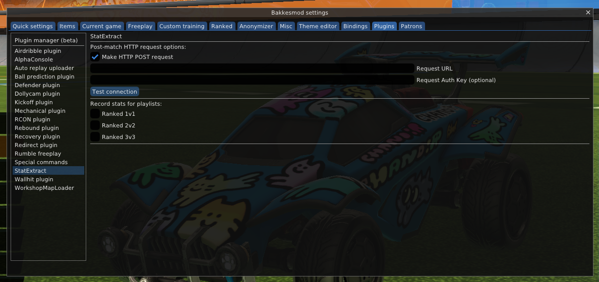

## Context

#### For those passing by...

Rocket League is an infamous competitive e-sport video game currently maintained by Epic Games. Players control rocket-powered cars to hit a giant ball in a goal, kind of like soccer but with vehicles. It is known to be the closest a video game can be to a real sport due to its deep iceberg to level of possible skill. So, analytical data can be useful for improving and staying competitve.

BakkesMod, as the name suggests, is a mod for the game made by Chris Bakkes. It began as a standalone tool to help players train but evolved into an SDK for developers to expand the mod via plugins, with permission from Epic Games. The mod injects a .dll into the game's memory and hooks directly to the game's Unreal Engine objects and functions, allowing developers to read modify the game's state.
## Overview

This plugin will bundle your match's scoreboard statistics and send it with a POST request to a server endpoint of your choice after the match finishes. The plugin will also capture the scorer and timestamp of each goal, your MMR before and after the match, every player's unique IDs, and more.

If notifications are enabled via BakkesMod, you will be notified after the match is finished if all stats were successfully captured and if the POST request was successful (server returned 200). Otherwise, you will be notified with the status code that the server returned.
## Usage

With Rocket League open at the main menu, press F2 to open the BakkesMod console and navigate to the "Plugins" tab at the top. 

Select "Plugin manager (beta)" and "Open pluginmanager".

Ensure the box next to `StatExtract` is checked.

Close this window and navigate to the `StatExtract` tab on the left. You should see the following:

Hover over each option for further descriptions. You may enter your server URL and some authentication key as you wish. The authentication key will be sent as a header called `x-auth-key`.
## Installation  

Close Rocket League and install [BakkesMod](https://bakkesplugins.com/).

Install the `StatExtract.dll` file in the `plugins/` directory from this repo.

Open BakkesMod on your machine.

Press `File > Open BakkesMod folder`. You should be in the following directory:
`C:/Users/{user}/AppData/Roaming/bakkesmod/bakkesmod/`

From here, go into the `plugins/` directory. You should see a bunch of `.dll` files for all the default BakkesMod plugins. Copy the `StatExtract.dll` that you downloaded into this directory. You may close your file explorer once it is copied.

Ensure BakkesMod is open, then open Rocket League.

  
